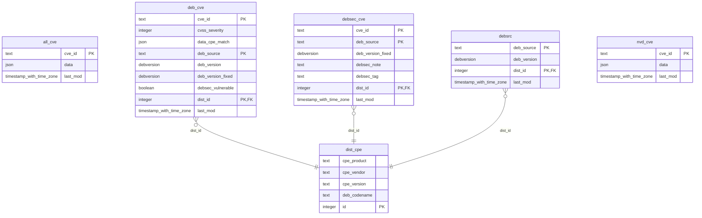

# Ingestion

The Security Tracker `glvd` uses a database to access all the data it needs to provide information about CVEs that are relevant in Garden Linux. Thereby, the data is gathered from multiple sources and stored in a PostgreSQL database. From there, the Security Tracker uses this data and offers it in a JSON format via its API endpoints.

## Introduction

The data is gathered on daily bases and pushed into the corresponding PostgreSQL database. This process step is called data ingestion and for this the following Git repository has been created:
* [gardenlinux/glvd-data-ingestion](https://github.com/gardenlinux/glvd-data-ingestion)

This repository uses Github Actions to gather information from NVD, Debian and Garden Linux to push them into the database. In addition, it also combines information, so that most of the processing is already done in the database and the application logic of the Security Tracker can be kept small.

## Database

The PostgreSQL database is operated as a container on an EC2 instance running on AWS. This infrastructure is provided by the following Git repository:
* [gardenlinux/glvd-infrastructure](https://github.com/gardenlinux/glvd-infrastructure)

In order to run a PostgreSQL container that fits the `glvd`'s needs, a dedicated Git repository has been created which takes the generally available PostgreSQL container image and installs required extensions and configuration into the container needed by the Security Tracker. A corresponding Github Action builds the container and publishes it. You can find the repository and the corresponding container image here:
* [gardenlinux/glvd-postgres](https://github.com/gardenlinux/glvd-postgres)

Next to this, there are a handfull of tables that are consumed by `glvd`.

Entity relationship diagram generated using [mermerd](https://github.com/KarnerTh/mermerd):

The following section shows, what database tables exists, how they are defined and which purpose those have:

---
##### Table: `nvd_cve`
This table contains the CVEs from NVD so that `glvd` can immediately access all available CVEs without querying the NVD API endpoint.

| Attribut | Description |
|----------|-------------|
|`cve_id`    | The ID of the CVE. (e.g `CVE-1999-0095`) |
|`last_mod`    | The last modification date of this data (e.g `2019-06-11 20:29:00.263+00`). |
|`data`   | The actual CVE data from NVD. This is stored as a JSON.|

---
##### Table: `all_cve`
Compared to `nvd_cve`, this table contains all known CVEs of the `glvd`. This table is filled by the `combine-all` ingestion command which takes not only NVD CVEs but also CVEs that are only known by for example Debian. In other words, the `nvd_cve` is a subset of the `all_cve` table.

| Attribut | Description |
|----------|-------------|
|`cve_id`    | The ID of the CVE. (e.g `CVE-1999-0095`) |
|`last_mod`    | The last modification date of this data (e.g `2019-06-11 20:29:00.263+00`). |
|`data`   | The actual CVE data from NVD. This is stored as a JSON.|

---
##### Table: `dist_cpe`
This table contains all available CPEs in `glvd` split between multiple products (e.g `debian_linux` or `gardenlinux`). Thereby, those CPEs represent each available distribution in `glvd`. Typically, these are all Debian distributions and all Garden Linux ones.

| Attribut | Description |
|----------|-------------|
|`id`    | ID of the entry |
|`cpe_vendor`    | The vendor of the CPE (e.g `debian`) |
|`cpe_product`    | The product of the CPE (e.g `debian_linux`) |
|`cpe_version`    | The version of the CPE (e.g `11`) |
|`deb_codename`    | The codename of an CPE product (e.g `bullseye`) |

---
##### Table: `debsrc`
Contains all source packages of each supported distribution of `glvd`. What distributions are supported is defined via the `dist_cpe` table. Each distribution is there represented by a CPE.
| Attribut | Description |
|----------|-------------|
|`dist_id`    | The ID of the corresponding distribution. This references the `id` attribute of `dist_cpe`. |
|`last_mod`    | The last modification date of this data (e.g `2019-06-11 20:29:00.263+00`) |
|`deb_source`    | The name of the source package (e.g `0ad`) |
|`deb_version`   | The version of the source package (e.g `0.0.23.1-2`) |

---
##### Table: `debsec_cve`
This table contains the entries of the CVE list (`debsec`) of each distribution defined in the `dist_cpe` table. Each CPE product provides its own CVE list which explains what CVE exists in context of the distribution and what the status of this corresponding CVE is. In some cases, CVE might be already fixed by the distribution. In such cases, the list would contain an entry explaining that the distribution is not affected by the corresponding CVE.

For Debian for example, this table contains the CVE entries from this list here:
* https://salsa.debian.org/security-tracker-team/security-tracker/-/blob/master/data/CVE/list

| Attribut | Description |
|----------|-------------|
|`dist_id`    | The ID of the corresponding distribution. This references the `id` attribute of `dist_cpe`. |
|`cve_id`   | The ID of the CVE itself. This references the `cve_id` attribute of `all_cve`. |
|`deb_source`    | References |
|`deb_version_fixed`    | Defines if the source package's version is fixed or not |
|`debsec_tag`    | A specific tag of the CVE list entry |
|`debsec_note`    | A specific note for the CVE list entry |

---
##### Table: `deb_cve`
Whereas the `debsec_cve` table is the plain representation of the given CVE list of a distribution, this `deb_cve` table basically contains the same information but is enriched by additional information that are put together, so that processing is easier for `glvd`.

| Attribut | Description |
|----------|-------------|
|`dist_id`    | The ID of the corresponding distribution. This references the `id` attribute of `dist_cpe`. |
|`cve_id`    | The ID of the CVE itself. This references the `cve_id` attribute of `all_cve`. |
|`last_mod`    | The last modification date of this data (e.g `2019-06-11 20:29:00.263+00`) |
|`cvss_severity`    | The CVSS Severity of the given CVE in comparision to the package and the distribution. |
|`deb_source`    | The name of the source package (e.g `389-ds-base`) |
|`deb_version`    | The latest version of the source package (e.g `2.3.1+dfsg1-1`) |
|`deb_version_fixed`    | The source pacakge version in which a given CVE has been fixed (e.g `1.2.11.15-1`)|
|`debsec_vulnerable`    | Defines if the CVE list entry (debsec) is affected by the CVE or not (e.g `f`) |
|`data_cpe_match`    | The CPE match string for the given CVE in relation to the source package (e.g `{"criteria": "cpe:2.3:o:debian:debian_linux:12:*:*:*:*:*:*:deb_source\\=389-ds-base", "deb": {"versionLatest": "2.3.1+dfsg1-1", "versionEndExcluding": "1.2.11.15-1"}, "vulnerable": false}`)|
