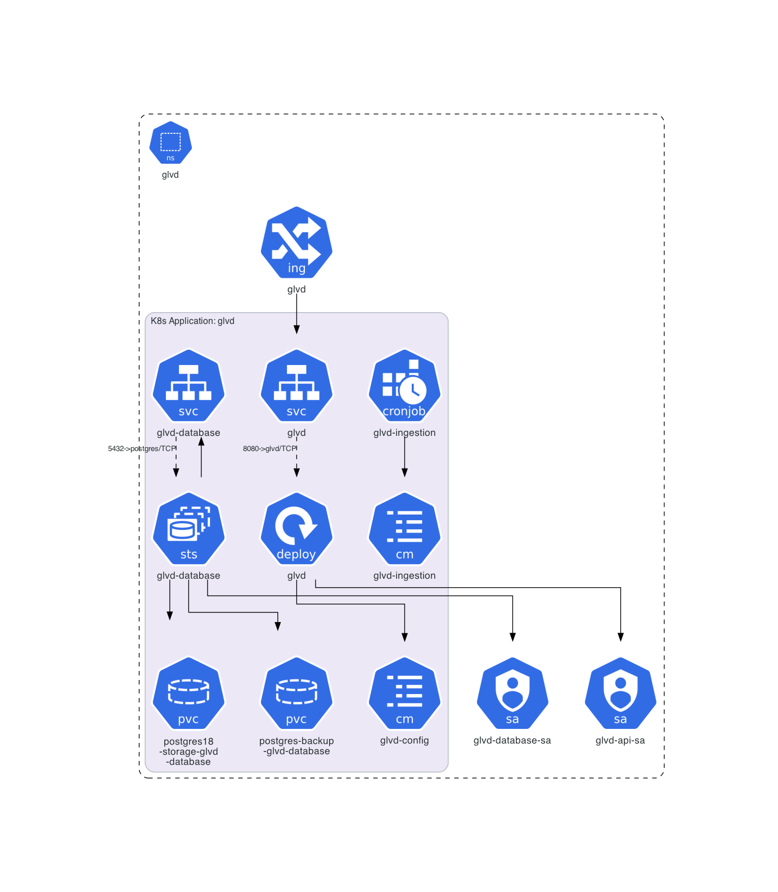

# Operations documentation

[GLVD Release Guide](./perform-release.md)

[Procedure for a major version upgrade of PostgreSQL](./UpgradePostgres.md)

[Recurring tasks to keep glvd running](./recurring-tasks.md)

This diagram provides an overview of the resources created in the `glvd` namespace.
It was created using [philippemerle/KubeDiagrams](https://github.com/philippemerle/KubeDiagrams).

