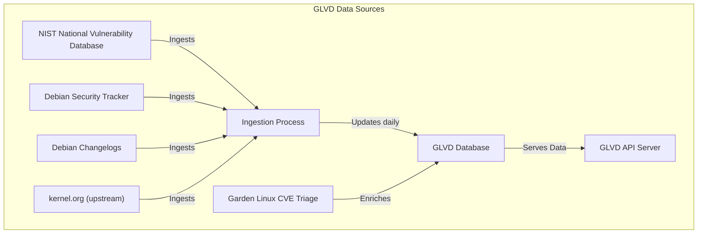

# Garden Linux Vulnerability Database (GLVD) User Guide

**Garden Linux Vulnerability Database (GLVD)** is a tool designed to help you track and manage software vulnerabilities (CVEs) affecting Garden Linux systems.

Garden Linux is built on [Debian GNU/Linux](https://www.debian.org/), and GLVD leverages data from the [Debian Security Tracker](https://security-tracker.debian.org/tracker/) to provide up-to-date vulnerability information.

Use this guide to get started with GLVD and ensure your Garden Linux deployments remain secure.

## Concepts

### Data Sources

GLVD aggregates vulnerability data from multiple trusted sources to provide comprehensive and up-to-date information. The primary sources include:

- **NIST National Vulnerability Database (NVD):** A widely recognized repository of standardized vulnerability information.
- **Debian Security Tracker:** The authoritative source for security issues affecting Debian packages.
- **Debian Package Changelogs:** These logs offer insights into security fixes and updates directly from package maintainers.
- **kernel.org:** The official source for Linux kernel-specific CVEs and related security advisories.
- **CVE Triage Data from the Garden Linux Team:** Expert-reviewed data curated specifically for Garden Linux.

The following diagram illustrates how GLVD collects and processes vulnerability data from various trusted sources.

### Triage Data

The Garden Linux team actively reviews CVEs affecting Garden Linux and enriches vulnerability data with additional context. This may include marking issues as false positives, identifying vulnerabilities that are not relevant to typical Garden Linux use cases, or noting when a patched version will be available in an upcoming minor release. This triage process helps users better understand the real impact of reported vulnerabilities on their systems.

### Limitations of GLVD

GLVD is designed to provide vulnerability information based on trusted external sources, but there are important limitations to be aware of:

- **No Binary Scans:**  
    GLVD does not scan your system images or analyze binary files directly. Instead, it reports vulnerabilities based on information from trusted sources like the Debian Security Tracker. This means GLVD checks which packages are known to be vulnerable, but it does not inspect your actual files or running systems. Sometimes, this can lead to false positives. GLVD might list a vulnerability for a package even if that package is not installed or not exploitable in your environment. Always review the reported vulnerabilities in the context of your own systems to assess real risks.

- **Based on Source Packages:**  
    The Debian Security Tracker reports vulnerabilities for Debian **source packages**. A single source package can produce multiple binary packages, but not all of these binaries are necessarily present in Garden Linux. As a result, GLVD may sometimes report vulnerabilities for binary packages that are not included or used in your environment. This is a fundamental limitation and can lead to false positives. Always review reported vulnerabilities in the context of your actual package set.

Familiarize yourself with these limitations to accurately interpret GLVD reports and assess risks in the context of your own systems.

## User Interfaces

GLVD offers a user-friendly web application designed to be deployed within a Gardener-managed Kubernetes cluster. This intuitive interface makes it easy to access and explore vulnerability data relevant to your Garden Linux systems.

### API

GLVD offers a comprehensive HTTP API, enabling you to programmatically access vulnerability information and integrate GLVD with your existing workflows or automation tools.

- **API Reference:**  
    The HTTP API is fully documented at [https://gardenlinux.github.io/glvd-api/](https://gardenlinux.github.io/glvd-api/).  
    This documentation is generated using Spring REST Docs, ensuring it accurately reflects the current API behavior. While example data is provided for demonstration, the request and response formats match those of a live GLVD deployment.

- **Interactive API Explorer:**  
    An automatically generated Swagger/OpenAPI interface is available at [https://security.gardenlinux.org/swagger-ui/index.html](https://security.gardenlinux.org/swagger-ui/index.html).  
    This interactive documentation is useful for exploring and testing the API. However, it is not actively maintained, so for the most reliable and up-to-date information, refer to the [Spring REST Docs](https://gardenlinux.github.io/glvd-api/).

### Web UI

The GLVD web user interface is built as a visual layer on top of the HTTP API. It provides an interactive and convenient way to browse, search, and review vulnerability data without the need for direct API calls.

- **Intuitive Browsing:**  
    The Web UI is designed for easy navigation and exploration of vulnerability information, making it accessible even for users without programming experience.

- **Intended Usage:**  
    While the Web UI is ideal for interactive data exploration, it is not intended to serve as a standalone tool for automated vulnerability management. For advanced use cases or integration with other systems, the HTTP API is recommended.

Together, the API and Web UI provide flexible options for accessing and managing vulnerability data, whether you prefer automation or hands-on exploration.

### GLVD Client

Garden Linux provides a command-line client for GLVD, available through the standard APT repository.

- **Installation:**  
    You can install the client by enabling the `glvd` feature during the build process, or by manually installing the `glvd` package using APT.

- **Usage:**  
    The client checks for known vulnerabilities based on your Garden Linux version and the packages installed on your system.

This tool makes it easy to stay informed about relevant CVEs directly from your Garden Linux environment.
