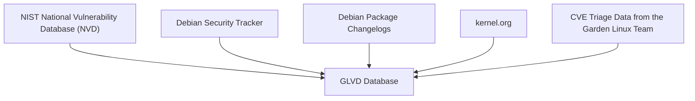

# Garden Linux Vulnerability Database (GLVD) User Guide

**Garden Linux Vulnerability Database (GLVD)** is a tool designed to help you track and manage software vulnerabilities (CVEs) affecting Garden Linux systems.

Garden Linux is built on [Debian GNU/Linux](https://www.debian.org/), and GLVD leverages data from the [Debian Security Tracker](https://security-tracker.debian.org/tracker/) to provide up-to-date vulnerability information.

Use this guide to get started with GLVD and ensure your Garden Linux deployments remain secure.

## Concepts

GLVD aggregates vulnerability data from multiple trusted sources to provide comprehensive and up-to-date information. The primary sources include:

- **NIST National Vulnerability Database (NVD):** A widely recognized repository of standardized vulnerability information.
- **Debian Security Tracker:** The authoritative source for security issues affecting Debian packages.
- **Debian Package Changelogs:** These logs offer insights into security fixes and updates directly from package maintainers.
- **kernel.org:** The official source for Linux kernel-specific CVEs and related security advisories.
- **CVE Triage Data from the Garden Linux Team:** Expert-reviewed data curated specifically for Garden Linux.

It is important to understand that GLVD does not perform direct scanning of system images or analyze binary files. Instead, it relies on the vulnerability status as reported by the Debian Security Tracker and other upstream sources. As a result, there may occasionally be false positives—packages flagged as vulnerable even if they are not present or exploitable in your specific environment. Always review reported vulnerabilities in context to ensure accurate risk assessment.

## User Interfaces

GLVD offers a user-friendly web application designed to be deployed within a Gardener-managed Kubernetes cluster. This intuitive interface makes it easy to access and explore vulnerability data relevant to your Garden Linux systems.

### API

GLVD offers a comprehensive HTTP API, enabling you to programmatically access vulnerability information and integrate GLVD with your existing workflows or automation tools.

- **API Reference:**  
    The HTTP API is fully documented at [https://gardenlinux.github.io/glvd-api/](https://gardenlinux.github.io/glvd-api/).  
    This documentation is generated using Spring REST Docs, ensuring it accurately reflects the current API behavior. While example data is provided for demonstration, the request and response formats match those of a live GLVD deployment.

- **Interactive API Explorer:**  
    An automatically generated Swagger/OpenAPI interface is available at [https://security.gardenlinux.org/swagger-ui/index.html](https://security.gardenlinux.org/swagger-ui/index.html).  
    This interactive documentation is useful for exploring and testing the API. However, it is not actively maintained, so for the most reliable and up-to-date information, refer to the [Spring REST Docs](https://gardenlinux.github.io/glvd-api/).

### Web UI

The GLVD web user interface is built as a visual layer on top of the HTTP API. It provides an interactive and convenient way to browse, search, and review vulnerability data without the need for direct API calls.

- **Intuitive Browsing:**  
    The Web UI is designed for easy navigation and exploration of vulnerability information, making it accessible even for users without programming experience.

- **Intended Usage:**  
    While the Web UI is ideal for interactive data exploration, it is not intended to serve as a standalone tool for automated vulnerability management. For advanced use cases or integration with other systems, the HTTP API is recommended.

Together, the API and Web UI provide flexible options for accessing and managing vulnerability data, whether you prefer automation or hands-on exploration.
